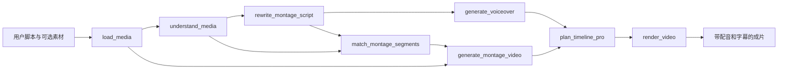

<div align="center">

  <h1>🎬 视频混剪工作流</h1>

  <p>
    
    
    
    
    
  </p>
</div>

<div align="center">

[🏠 项目主页](../../../README_zh.md) • [🛠️ 工作流 Skill](./SKILL.md) • [📖 使用指南](../../../docs/source/zh/guide.md) • [🔑 API Key 配置](../../../docs/source/zh/api-key.md)

</div>

**视频混剪工作流（`video-montage-workflow-skill`）** 根据用户脚本自动完成脚本改写、分镜拆分、素材理解与匹配、缺失镜头生成、逐段 TTS 配音、字幕对齐、时间线编排和成片渲染。

工作流优先使用用户上传的真实素材；素材无法覆盖的分镜才调用视频生成模型补齐。每个分镜的 `text` 同时作为该段 TTS 台词和基础字幕内容，确保画面、旁白和字幕按照统一的 `segment_id` 对齐。

> 本工作流面向“脚本成片”和“真实素材 + AI 补镜”的基础混剪场景。用户无需额外指定目标风格、成片时长或复杂剪辑参数。

## ✨ 核心能力

- ✍️ **脚本改写与结构化分镜**：在保留原脚本核心事实、人物关系、事件顺序和品牌信息的前提下，将脚本拆分为可执行分镜。
- 🎞️ **上传素材优先**：先加载和理解真实素材，再按主体、场景、动作和叙事作用匹配分镜，避免仅根据关键词强行匹配。
- 🧩 **AI 自动补镜**：将未匹配或只部分匹配的分镜标记为 `generated` 或 `mixed`，并使用已配置的视频生成服务补齐缺失画面。
- 🔗 **镜头连续性控制**：生成片段参考前后镜头的主体、动作方向、色调、光线和空间关系，并尽可能使用相邻镜头首尾帧作为生成锚点。
- 🔊 **逐段 TTS 配音**：每个 `segment_id` 的 `text` 单独生成配音，默认使用豆包 TTS 2.0（`seed-tts-2.0`）。
- 💬 **自动基础字幕**：每段字幕与对应 `text` 一致，并与该段配音使用相同时间窗。
- ⏱️ **音画时长适配**：配音长于原分镜时，时间线通过连续平滑变速延长画面，避免用尾帧冻结补时造成卡顿。
- 🛡️ **结构和引用校验**：校验分镜字段、素材 ID、分镜 ID、来源类型和上下游依赖；任一 Node 失败后停止工作流。

## 🏗️ 工作流架构



固定主链为：

```text
load_media
  → understand_media
  → rewrite_montage_script
  → generate_voiceover
  → match_montage_segments
  → generate_montage_video
  → plan_timeline_pro
  → render_video
```

> 每个 Node 都通过 MCP 包装为同名 Tool。Skill 规定调用顺序与业务约束，Node 负责具体处理，Tool 是 Agent 调用 Node 的接口。

## 🧱 Node 说明

| 顺序 | Node / Tool | 主要输入 | 主要输出 | 作用 |
|---:|---|---|---|---|
| 1 | `load_media` | 当前会话上传素材 | `media` | 建立真实素材索引，读取路径、类型、尺寸和时长 |
| 2 | `understand_media` | `load_media` | 素材描述、整体概述 | 理解素材中的主体、场景、动作和美学信息 |
| 3 | `rewrite_montage_script` | 用户 `script`、素材理解结果 | `rewritten_script`、`segments` | 改写脚本并拆分结构化分镜 |
| 4 | `generate_voiceover` | 每个分镜的 `text` | `voiceover` | 按 `segment_id` 逐段生成 TTS 音频 |
| 5 | `match_montage_segments` | 分镜、素材理解结果 | 匹配后的 `segments` | 决定使用上传素材、AI 生成素材或混合素材 |
| 6 | `generate_montage_video` | 匹配结果、真实素材 | `clips`、`groups`、生成片段 | 为 `generated` / `mixed` 分镜补齐视频 |
| 7 | `plan_timeline_pro` | 画面分组、配音 | 视频、配音、字幕时间线 | 对齐音画，创建与配音同步的字幕轨道 |
| 8 | `render_video` | 时间线与素材 | 最终视频路径 | 烧录字幕、混合配音并输出成片 |

## 📝 分镜数据结构

`rewrite_montage_script` 会把原脚本转换为有序 `segments`：

```json
{
  "rewritten_script": "先将番茄洗净切块，再倒入锅中翻炒。",
  "segments": [
    {
      "segment_id": "segment_0001",
      "text": "先把洗净的番茄切成小块。",
      "visual_intent": "厨房操作台上，一双手将番茄切成均匀小块",
      "duration": 4.0,
      "tone": "自然、清晰",
      "camera_motion": "近景固定镜头，轻微推进",
      "continuity_hint": "保持暖色厨房光线，动作向右延续",
      "source_type": "uploaded",
      "clip_ids": ["clip_0001"],
      "generation_prompt": ""
    }
  ]
}
```

其中：

- `text`：只包含需要朗读的纯台词，同时作为基础字幕，不得包含“字幕”“字幕重点”“结尾字幕”等提示标签。
- `visual_intent`：只描述画面主体、场景和动作，不作为 TTS 输入。
- `source_type`：脚本改写阶段为 `uploaded` 或 `generated`；素材匹配阶段还可以输出 `mixed`。
- `clip_ids`：只能引用当前会话中真实存在的素材 ID，系统会拒绝模型编造的 ID。
- `generation_prompt`：仅在需要生成或补充画面时使用。

## 🔊 配音与字幕

工作流使用以下映射保持逐段同步：

```text
segment.segment_id ─┬─→ voiceover.group_id
                    └─→ subtitle.group_id

segment.text       ─┬─→ TTS 朗读内容
                    └─→ 字幕显示内容

voiceover.timeline_window = subtitle.timeline_window
```

默认 TTS 配置：

```toml
[generate_voiceover]
tts_provider_params_path = "./resource/tts/tts_providers.json"
default_provider = "doubao_tts_2"

[generate_voiceover.providers.doubao_tts_2]
base_url = "https://openspeech.bytedance.com/api/v3/tts/unidirectional/sse"
api_key = "YOUR_TTS_API_KEY"
resource_id = "seed-tts-2.0"
```

当前代码还支持以下 TTS 提供方：

- `doubao_tts_2`：默认，豆包 TTS 2.0 / `seed-tts-2.0`
- `bytedance`
- `minimax`：支持 `speech-02-hd`、`speech-02-turbo`、`speech-2.6-hd`
- `302`：支持 `speech-02-hd`

如果 TTS 没有返回有效的 `voiceover_id`、`group_id`、文件路径和时长，工作流会停止，不会继续生成静音成片。

## 🎥 AI 视频生成约束

AI 视频只用于上传素材无法覆盖的分镜，并遵循以下规则：

- 视频生成 prompt 不包含分镜台词 `text`，防止模型把台词直接生成在画面中。
- prompt 必须描述主体、场景、动作、运镜、光线、色彩和前后衔接。
- 最终 prompt 强制禁止可见文字、字幕、标题、字母、Logo、标牌、标签和水印。
- 字幕只能由 `plan_timeline_pro` 建轨，再由 `render_video` 后期烧录。
- 不得生成脚本和上传素材中不存在的人物、事件、产品、地点或品牌。

视频生成复用项目的 AI 视频服务配置，例如：

```toml
[generate_ai_transition]
default_provider = "dashscope"

[generate_ai_transition.providers.dashscope]
model_name = "wan2.2-kf2v-flash"
api_key = "YOUR_VIDEO_GENERATION_API_KEY"
```

## 🚀 快速开始

### 1. 安装并配置项目

先按照项目主 README 完成环境和资源安装：

- [项目安装说明](../../../README_zh.md#-安装)
- [API Key 配置](../../../docs/source/zh/api-key.md)

不要把真实 API Key 提交到 Git 仓库；上面的配置仅展示字段格式。

### 2. 启动服务

在项目根目录执行：

```bash
./run.sh foreground
```

默认地址：

- Web：`http://127.0.0.1:7860`
- MCP：`http://127.0.0.1:8001`

### 3. 通过 Web 对话使用

打开 Web 页面，上传一个或多个视频/图片素材，然后发送脚本，例如：

```text
请根据下面的脚本生成一个混剪视频：

周末的午后，我来到厨房准备一道简单的番茄料理。
先把番茄切块，再放入锅中慢慢翻炒，直到汤汁变得浓郁。
```

对话模式下可以不上传素材；没有真实素材时，工作流会把全部分镜标记为 AI 生成。

### 4. 通过自动剪辑 API 使用

#### 创建会话

```bash
curl -X POST http://127.0.0.1:7860/api/sessions
```

响应中记录：

```json
{
  "session_id": "YOUR_SESSION_ID"
}
```

#### 上传素材

```bash
curl -X POST \
  -F "file=@/absolute/path/to/input.mp4" \
  http://127.0.0.1:7860/api/sessions/YOUR_SESSION_ID/media
```

单文件上传响应中会包含：

```json
{
  "media_id": "YOUR_MEDIA_ID"
}
```

#### 提交混剪任务

```bash
curl -X POST \
  -H "Content-Type: application/json" \
  -d '{
    "script": "先把番茄切块，再放入锅中翻炒。",
    "media_ID": "YOUR_MEDIA_ID"
  }' \
  http://127.0.0.1:7860/api/sessions/YOUR_SESSION_ID/edit
```

接口立即返回：

```json
{
  "status": "processing"
}
```

> 当前自动剪辑 API 的 `media_ID` 是必填字段；纯脚本无素材场景请使用 Web 对话工作流。

#### 查询结果

```bash
curl http://127.0.0.1:7860/api/sessions/YOUR_SESSION_ID/result
```

处理中：

```json
{
  "status": "processing"
}
```

完成后：

```json
{
  "status": "completed",
  "media_id": "RESULT_MEDIA_ID",
  "video_url": "RESULT_VIDEO_URL"
}
```

失败时：

```json
{
  "status": "failed",
  "error": "失败节点和错误原因"
}
```

`video_url` 依赖 `[result_upload]` 配置；未启用或上传失败时可能为空，但本地渲染文件仍保存在项目输出目录中。

## 🛡️ 校验与失败处理

工作流不会直接信任模型输出，而是对关键结构执行校验：

- `segment_id` 必须有效、唯一并保持原分镜顺序。
- `source_type` 只能是 `uploaded`、`generated` 或 `mixed`。
- 上传素材 ID 必须存在于 `load_media` / `understand_media` 的真实结果中。
- `uploaded` 必须引用素材；`generated` 必须提供生成提示词；`mixed` 必须同时具备真实素材和补充提示词。
- 每个分镜必须有对应的有效配音，字幕内容和时间窗必须与配音对齐。
- 后续 Node 只能使用当前工作流开始后生成的前置结果，避免误用旧会话产物。
- 任一 Node 返回 `isError=true` 时立即停止，不使用错误或不完整结果继续渲染。

## 📁 相关目录

```text
FireRed-OpenStoryline/
├── .storyline/skills/video-montage-workflow-skill/
│   ├── SKILL.md                         工作流执行规范
│   └── README.md                        本文档
├── prompts/tasks/
│   ├── rewrite_montage_script/          脚本改写提示词
│   └── match_montage_segments/          素材匹配提示词
├── src/open_storyline/
│   ├── api/
│   │   ├── Yuanji_API_router.py         自动剪辑 REST 路由
│   │   └── Yuanji_API_service.py        固定主链与任务状态管理
│   ├── mcp/hooks/node_interceptors.py   Node 依赖和运行时配置注入
│   └── nodes/core_nodes/
│       ├── rewrite_montage_script.py    脚本改写与分镜校验
│       ├── generate_voiceover.py        逐段 TTS
│       ├── match_montage_segments.py    素材匹配
│       ├── generate_montage_video.py    缺失镜头生成
│       ├── plan_timeline_pro.py         音画字幕时间线
│       └── render_video.py              最终渲染
├── resource/tts/tts_providers.json      TTS 参数规则
├── config.toml                          服务与模型配置
└── outputs/                             默认产物目录
```

## ⚠️ 使用说明

> <sub>
> 🎬 <b>生成耗时：</b>AI 视频生成依赖第三方服务，通常明显慢于脚本改写和 TTS，请通过结果接口轮询任务状态。<br>
> 🧠 <b>生成稳定性：</b>提示词和首尾帧约束可以降低画面跳变，但生成式视频仍具有不确定性，不能保证完全不出现伪文字或细节变化。<br>
> 🔊 <b>音频要求：</b>TTS 配置不完整或服务不可用时，工作流会失败关闭，不会静默输出无声视频。<br>
> 💬 <b>字幕规则：</b>基础字幕固定来自分镜 `text`；视频模型不得自行生成字幕，避免重复字幕、乱码和伪文字。<br>
> 🎵 <b>背景音乐：</b>当前基础混剪主链默认不主动添加 BGM。<br>
> 🔐 <b>密钥安全：</b>请使用自己的服务密钥，并避免将包含真实密钥的 `config.toml` 提交到公共仓库。
> </sub>

## 📄 License

本工作流随 FireRed-OpenStoryline 项目按照 [Apache License 2.0](../../../LICENSE) 发布。
